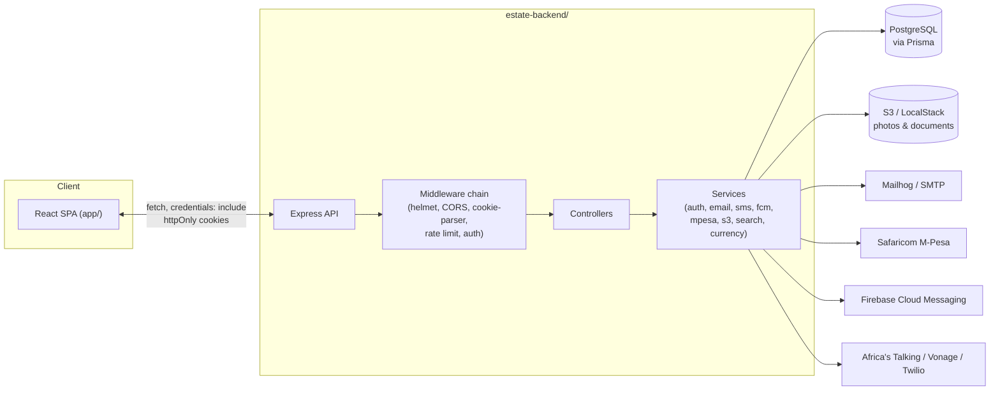
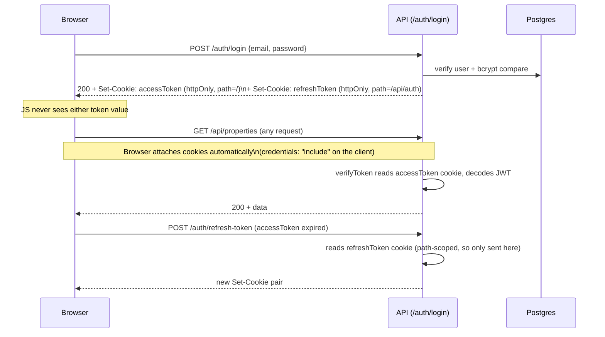
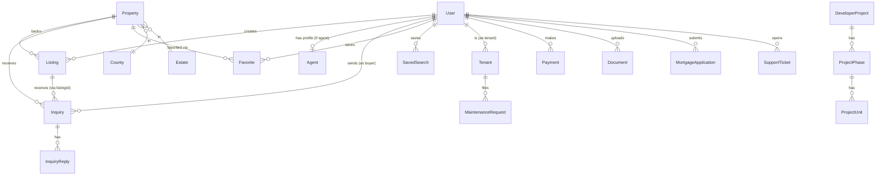
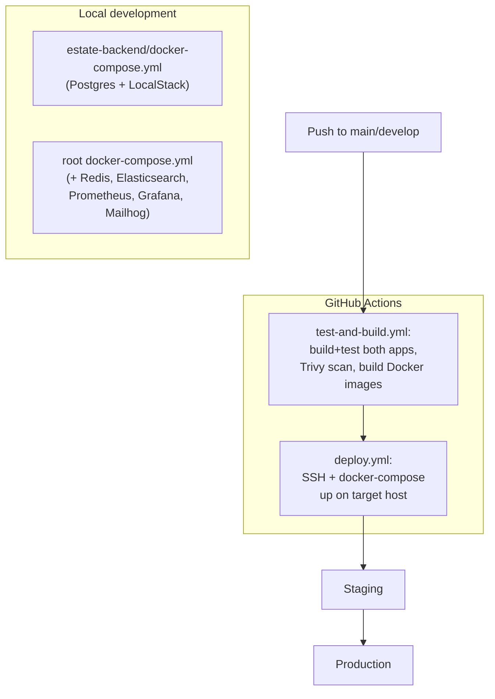

# Software Architecture Document (SAD) — EstateIn

Companion to [PRD.md](./PRD.md) (what/why) and [API_REFERENCE.md](./API_REFERENCE.md) (endpoint-level contract). This document covers how the system is built.

## 1. Architectural overview

EstateIn is a two-tier web application: a React SPA talking to a REST API over HTTPS, backed by PostgreSQL, with S3-compatible object storage for media and a handful of third-party integrations (email, SMS, push, M-Pesa).



## 2. Frontend architecture (`app/`)

- **Stack**: React 19, TypeScript, Vite, Tailwind CSS, react-router-dom.
- **Structure**: `pages/` (route-level components, including `pages/dashboard/` and `pages/agent/` for role-specific dashboards), `components/` (shared UI), `lib/` (cross-cutting concerns), `data/` (static fallback content used before/if the API call resolves).
- **Data flow**: pages call `lib/api-client.ts` (a thin `fetch` wrapper) directly in `useEffect`/event handlers; there is no client-side cache/query layer (no React Query/SWR) — each page manages its own loading/error state.
- **Auth**: `lib/auth-api.tsx` exposes `AuthProvider`/`useAuth`/`ProtectedRoute`. On mount it calls `GET /auth/me`; because the session token lives in an httpOnly cookie invisible to JS, this call — not a local token check — is the only way to know if a session exists. `ProtectedRoute` gates dashboard routes by role.
- **Shared response-shape helpers**: `lib/normalizers.ts` (`mapListing`, `mapInquiry`, `unwrapList`) centralize turning the API's nested `{ user, property }` listing/inquiry shape into the flat shape dashboards render, so field-mapping logic doesn't drift per page.
- **Modal accessibility**: `lib/useModalA11y.ts` is a shared hook providing focus trap, focus restore, and body-scroll lock, used by both `ConfirmDialog` and `InquiryModal`.
- **Design tokens**: Tailwind config defines the color palette (`primary` for filled UI/icons, `primary-text` — a lighter shade — for text/links on dark backgrounds, chosen so both meet WCAG AA contrast in their respective uses).

## 3. Backend architecture (`estate-backend/`)

Layered, one file per resource across three parallel folders:

```
routes/*.ts  →  controllers/*.ts  →  services/*.ts (where business logic warrants it)  →  Prisma  →  PostgreSQL
```

- **`app.ts`** wires global middleware in order: `helmet` → custom security headers → CORS (credentialed, origin = `FRONTEND_URL`) → `compression` → body parsing → `cookie-parser` → request logging (Pino) → rate limiting (`apiLimiter`) → `verifyToken` (attaches `req.user` if a valid cookie/header token is present) → mounted routes → 404 handler → global error handler.
- **`middleware/auth.ts`**: `verifyToken` (global, non-blocking), `requireAuth` (401 if no `req.user`), `requireRole(...)` (403 if wrong role), `optionalAuth` (route-local variant of verifyToken for endpoints that behave differently for logged-in vs anonymous callers).
- **`validators/*.ts`**: Zod schemas applied via `middleware/validation.ts`'s `validate(schema, source)`, which parses `req.body`/`query`/`params` and 400s with field-level errors on failure.
- **`services/`**: integration and cross-cutting logic — `auth.ts` (token issuance/verification), `email.ts` (Nodemailer), `s3.ts` (upload/delete), `search.ts`, `notification.ts`, `currency.ts` (KES/USD/EUR/GBP), `mpesa.ts` (STK push + callback handling), `sms.ts`, `fcm.ts`, `oauth.ts`, `websocket.ts` (Socket.io), `otp.ts`, `twoFactor.ts`.
- **Route mounting** (`routes/index.ts`): 24 resource routers mounted under `/api/<resource>` — see [API_REFERENCE.md](./API_REFERENCE.md) for the full list. Four additional route files (`account`, `dataProtection`, `otpAuth`, `twoFactor`) exist but are not imported here — dead code today, not part of the live architecture.

## 4. Authentication & session architecture



- Access tokens: short-lived (default 24h), sent with every request, path `/`.
- Refresh tokens: longer-lived (default 7d), path-scoped to `/api/auth` so they're never sent to unrelated endpoints.
- Both are `httpOnly`, `sameSite: lax`, and `secure` in production — a determined XSS payload running in the page cannot read either token, unlike the previous `localStorage`-based design.
- CORS must specify an exact `FRONTEND_URL` origin (not a wildcard) for credentialed cookie requests to work at all.
- Fallback: `verifyToken`/`optionalAuth` also accept a Bearer `Authorization` header, preserved for non-browser API clients that can't hold cookies.

## 5. Data architecture

Prisma/PostgreSQL. Model groups (full detail in `estate-backend/prisma/schema.prisma`):



Key enums driving state machines: `ListingApprovalStatus` (`draft→pending→active/rejected→sold/expired`), `InquiryStatus` (`new→read→responded→archived`), `ViewingStatus` (`requested→confirmed/cancelled`), `PaymentStatus`, `VerificationStatus`, `ProjectPhaseStatus`, `UnitStatus` (`available→reserved→sold`), `MaintenanceStatus`, `TicketStatus`, `MortgageStatus`, `TenantStatus`.

Reference/lookup data: `County` (all 47 Kenyan counties) and `Estate` (Nairobi suburbs, extensible to other cities) are pre-seeded via `POST /locations/seed` (admin-only) and consumed read-only by search/filter UI.

## 6. Integration architecture

| Integration | Used for | Notes |
|---|---|---|
| AWS S3 (LocalStack in dev) | Listing photos, documents | `services/s3.ts`; keys namespaced `<folder>/<ownerId>/<file>` so ownership can be checked on delete without a DB round-trip |
| Nodemailer / SMTP (Mailhog in dev) | Verification, password reset, inquiry notifications, contact-form lead notifications | `services/email.ts` |
| M-Pesa (Safaricom) | STK push payment initiation + callback | `services/mpesa.ts`; callback endpoint is secured by a secret path token (`MPESA_CALLBACK_TOKEN`) rather than JWT, since Safaricom's servers can't hold a session |
| Africa's Talking / Vonage / Twilio | SMS notifications | `services/sms.ts`, provider-selectable |
| Firebase Cloud Messaging | Mobile/web push (device-token based) | `services/fcm.ts` — no consuming mobile client exists in this repo yet |
| Socket.io | Real-time (e.g. live inquiry updates) | `services/websocket.ts` — wired at the service layer; confirm current frontend usage before assuming it's fully live end-to-end |

## 7. Deployment architecture



- CI (`test-and-build.yml`) runs on push/PR to `main`/`develop`: backend/frontend build, Trivy filesystem vulnerability scan, SonarCloud quality scan, then builds and pushes Docker images to GHCR on `main`.
- CD (`deploy.yml`) deploys to staging on every push to `main`, then to production, via SSH into the target host and `docker-compose up -d` + `prisma migrate deploy`; includes a rollback job on failure.
- There is no orchestration layer (Kubernetes, ECS, etc.) — deployment target is host-level Docker Compose.

## 8. Cross-cutting concerns

- **Validation**: Zod schemas at the route boundary for most write endpoints (see API reference "known gaps" for the handful that aren't fully wired yet).
- **Error handling**: centralized `errorHandler`/`notFoundHandler` middleware in `app.ts`; controllers throw typed errors (`ValidationError`, `AuthenticationError`, `AuthorizationError`, `NotFoundError`, `ConflictError`) from `utils/errors.ts` that the handler translates into the standard `{ data: null, error: {...} }` shape.
- **Logging**: Pino request logger (`middleware/logging.ts`), pretty-printed in development.
- **Rate limiting**: `express-rate-limit`-based `apiLimiter` (global) and `authLimiter`/`uploadLimiter` (endpoint-specific, stricter).
- **Response shape**: every endpoint returns `{ data, message? }` on success or `{ data: null, error: {...} }` on failure; list endpoints use a paginated variant (`data`, `total`, `page`, `limit`, `pages`) — see [API_REFERENCE.md](./API_REFERENCE.md#response-shape).

## 9. Known architectural gaps

- Four route files (`account`, `dataProtection`, `otpAuth`, `twoFactor`) are implemented but not mounted — dead code paths that should either be wired in or removed, not left ambiguous.
- No client-side data-fetching/cache layer on the frontend — every page re-fetches and re-normalizes on mount, with duplicated (now partially centralized via `lib/normalizers.ts`) mapping logic.
- `properties` create/update/delete routes are documented in code comments as "agent/admin only" but the route middleware only enforces `requireAuth` — no role check currently exists at that layer.
- No formal API versioning scheme — `/api/*` is the only namespace; a breaking change would need a new prefix or careful client coordination.
